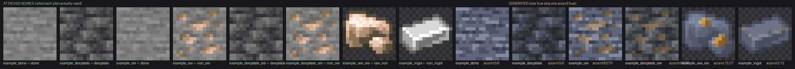
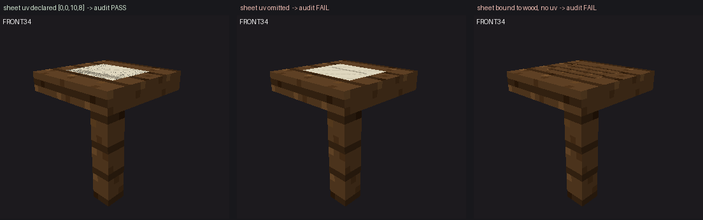

# dsh-mc-art · 从描述到可验证的 Minecraft mod

> **DSH 插件 + 做模组的 skill + 一个裁判。** 插件负责看和改，skill 负责流程，
> 裁判是游戏自带的 `GameTestServer`（无窗口服务端，**退出码 = 失败的必要测试数**）。
>
> **原生 Windows、通用。** 不绑某个 loader、不绑某个游戏版本、不写死任何机器的路径、
> 也不针对某一个 mod：别人拿到就能用。

美术引擎在另一个仓库：[`GMH13552/mc-art`](https://github.com/GMH13552/mc-art)
（确定性引擎：扫描资源根 / 出证据 / 栅格化 / 度量）。这个仓库**不含**它的副本 ——
同一个东西放两个仓库就会漂移；`install.mjs` 会替你把那一份拉下来。

版本与改动：见 [`CHANGELOG.md`](CHANGELOG.md)；许可：见 [`LICENSE`](LICENSE)（MIT）。

---

## 做出来长什么样

下面两张都是**工具链自己的产物**，可以用仓库里的命令重跑出同样的图。

**一个同族的方块集。** 左边是每个 plan **真正挂上的**原版参考 —— 注意 `example_ore` 挂了
**两张**（`stone` 打底、`iron_ore` 出矿点）；右边是产物。矿点用的是铁矿**自己的像素**、
并且是**嵌在石头里**的（不是贴上去的亮斑）；深板岩矿石与石头矿石成对存在；锭是冷灰金属
加一道取自 `iron_ingot` 自身明暗的淡暖光，而不是灰底上糊一块颜色。



**方块实体 UV。** 一个"深色木桌上摊一张纸"的方块实体。左：纸面声明了 `uv [0,0,10,8]`，
审计通过，纸的纹理与横格读得出来；中：漏写 `uv`，10×8 的面吃满 16×16，纸被拉伸；右：
纸面绑到木板贴图且无 `uv` —— 就是"只是稍微改改木板"的那种失败形态。后两种审计直接拒绝。



---

## 一、先看清分工：谁判断什么

这是这套东西最核心的一条，写在 `mc-mod` 的每一个阶段里（`references/workflow.md`）。
用户最大的抱怨是"太依赖脚本了，明明很多内容可以交给 AI 灵活处理"——根因就是把
**该由判断决定的事**推给了脚本。

| 该 **AI 判断**（审美、语境、意图） | 该 **脚本/工具判定**（度量、重复劳动） |
|---|---|
| 参考选哪张（深渊岩不能参考浅层原石） | 像素度量：调色板、明度范围、孤立像素数、平铺接缝 |
| 什么该是一个族、什么**故意**不像 | jar/pack/参考目录里**到底有什么** |
| 强调放哪、能占多少面积；命名与叙事 | 文件是不是合法 PNG；两份产物是不是逐字节相同 |
| 玩家看起来、用起来、读起来对不对 | 退出码与日志里的计数是否对得上；同一份计划反复栅格化结果一致 |

**工具绝不许替 AI 选参考**：它看不出深层与浅层的区别，只会取第一张名字对得上的，
于是一套东西不再像同一个 mod。**AI 也绝不许用眼睛代替度量**："大概十分之一是强调色"
是脚本一秒就能判定的事。两边都要留证据：判断写下"选了 X，因为……"，度量留下命令与输出。

## 二、里面有什么

| 路径 | 是什么 |
|---|---|
| `skills/mc-mod/` | **做模组的 skill**：说明书、stage 0–7 通用流程（每阶段"什么算过 + 谁判断"）、版本矩阵（讲"怎么查而不是猜"）、美术规程、Windows 注意事项、踩过的坑 |
| `tools/mcart-plugin/` | **面板插件**源码（DSH 动态 Cordis 插件）+ 加载器 + 门禁 |
| `panel/` | 面板的**真包**形态：`dsh plugin --profile web add <本仓库>/panel` 装进 profile，重启就在 |
| `tools/mcart_extract_block.py` | 抽取器：把一个方块/物品读成几何 + 贴图 + 表现形态 |
| `tools/mcart_scan_refs.py` | 参考扫描：从游戏目录/模组 jar 里列出命名空间与方块 |
| `tools/mcmod_gametest.py` | **判定工具**：跑 `GameTestServer`、读退出码、解析日志、给裁决；`--fault` 注入错误断言 |
| `examplemod/mod/` | 一个**完整可运行的示例模组**（Forge 1.18.2）：故意不带资源，只带代码 + 两条 GameTest |
| `presets/mc-studio/` | **MC 模组工作室**模式（agent preset）：把面板能力 + 流程 + 裁判包装成一个可选的模式 |

## 三、面板（`mcart`）

一个 Cordis 插件，把项目里的资产变成可以**看和改**的东西：

- **3D 取景框 + 游戏样式的九格物品栏**：选中格白框、翻页、名字浮层；**没有 3D 可看时
  把 2D 形式画进取景框**（物品只有物品模型时）；底边可拖动改高度（140–760 px，双击复位）。
- **物品浏览器**：按来源（本项目 / 原版 / 每个模组）、展示形式（方块/工具/盔甲/刷怪蛋/物品）、
  细分家族筛选，一页 40 格；点一格就放到 3D 里看。
- **像素编辑器**：铅笔 / 油漆桶 / 取色 / 橡皮，调色板、不透明度、撤销 24 步，方块可按面编辑；
  保存走"临时文件 → 校验是 PNG → 才替换原文件"，**只写项目自己的资源包**。
- **结构 / 群系编辑器**：按格放置（左键破坏、右键放置），带朝向、撤销与保存。
- **`@ 提意见`**：把资产的身份（atlas 引用，或物品的 `models/item/<id>.json`）插进输入框；
  设置改完还能一键把"改了什么"连同 `mc-art.settings.json` 一起插进去。
- **⚙ 设置**：参考目录（游戏目录或某个版本目录）、已产出的贴图是否也当参考、逐个模组开关。

面板**只写三个接口**：`atlas.saveTexture` / `atlas.saveVoxel` / `atlas.saveSettings`，
且只写进项目自己的包，从不写进 jar；**它不写会话、不写日志**——诊断报告只上屏、可复制。
画不出方块时给的是**结构化诊断**：区分"项目自己的模型缺失"与"原版母模型缺失"，
每条都带能直接照做的路径。完整说明书：`skills/mc-mod/references/panel.md`。

## 四、判定：让游戏自己说

`GameTestServer` 跑完注册的测试就退出，**退出码 = 失败的必要测试数量**。
本仓库实测（Forge 1.18.2 / 40.2.0，一次运行）：

| 跑法 | 服务端说 | 退出码 |
|---|---|---|
| 正常 | `All 2 required tests passed :)` | 0 |
| `--fault`（把断言改错） | `exampleblockplaces failed! <断言那句话> at 1,-59,1 (relative: 1,1,1)` + `1 required tests failed :(` | 1 |

首次构建约 26 分钟（Gradle + MC/Forge 依赖 + 几百 MB 资源），之后**每次约 1 分钟**。

```bash
cd examplemod/mod
python ../../tools/mcmod_gametest.py          # 裁决 + 机器可读 JSON
python ../../tools/mcmod_gametest.py --fault  # 必须失败，否则这个闭环是摆设
```

`--project <目录>` 可以指向**你自己的**模组工程，不限于示例。**能判行为的版本从 1.17 起**
（Forge 侧要 1.18.1+ / 39.0.88+）；1.12.2 没有 GameTest，最强的诚实说法只有
"能编译、服务端起来、日志干净"。怎么查目标版本到底支持什么：`versions.md`。

## 五、安装

### 5.1 装一个 npm 包就全有（推荐）

包里同时带着**面板 + 模式 + 两个 skill**（`mc-mod` 与 `mc-art` 的快照），
装完重启 DSH：右侧栏出现「MC 资产」，模式名单里出现「MC 模组工作室」。
不需要再手工往 `~/.dsh` 拷 skill 或 preset。

```bash
dsh plugin --profile web add dsh-mc-art-panel
# 桌面端 profile 通常叫 desktop：--profile desktop
# 国内走镜像：加 --registry=https://registry.npmmirror.com/
#   注意镜像是只读同步且会滞后，先 npm view 看它追到哪一版
# 不想依赖 npm，用 Release 里那份不带版本号的 tarball（URL 永久有效）：
#   https://github.com/GMH13552/dsh-mc-art/releases/latest/download/dsh-mc-art-panel.tgz
# 重启 DSH → 右侧栏出现「MC 资产」
```

### 5.2 从仓库装（开发 / 离线）

```bash
git clone https://github.com/GMH13552/dsh-mc-art.git
node dsh-mc-art/install.mjs      # Windows: dsh-mc-art\install.bat   POSIX: sh dsh-mc-art/install.sh
```

它做四件事：装 `mc-mod`；把美术引擎 `mc-art` 拉下来（已存在就 `git pull --ff-only`）；
装模式 `mc-studio`；**把面板装进 profile**（默认 `web`）。可重复执行。
`install.bat` / `install.sh` 只是找到 node 再转给同一份 `install.mjs`——逻辑只有一份，
不会两边各修一次、各漏一次。

> 美术引擎不是子模块，但会被自动装。为什么：它有自己的仓库、历史和节奏，本来也独立可用；
> 子模块会把它钉在某个 commit 上，而最常见的坑是 `git clone` 忘了 `--recursive`
> ——"装好了"却少了半个引擎。想手动装：
> `git clone https://github.com/GMH13552/mc-art.git ~/.dsh/skills/mc-art`

### 5.3 依赖

| 需要 | 用来做什么 | Windows 上从哪来 |
|---|---|---|
| Node + DeepSeek Harness | 跑面板插件 | 装 DSH 就有 |
| Python 3.10+ | 抽取器、扫描器、判定工具 | DSH 桌面版**自带**（见下）；否则自己装，命令名是 `python` 或 `py -3` |
| JDK 17 | 编译/运行 1.17–1.20.1 的模组（1.20.5+ 要 21） | 自己装一个普通 JDK（不要用游戏自带的 runtime，见第六节） |
| 一份 Minecraft 安装 | 当**参考目录**：原版/模组的模型与贴图从那里读 | 你的游戏安装 |

**DSH 桌面版自带一套运行时**：Python 3.12.x + Pillow、Node、pnpm，都在安装目录的
`resources/runtime/primary-runtime/dependencies/` 下。这台机器上实测是
Python 3.12.14 / Pillow 12.3.0 / Node 24.21.0 / pnpm 11.7.0——所以"你得先装 Python"
对桌面版用户是错的建议；用已经在的那份就行。（版本会随 DSH 更新，看目录而不是记数字。）

## 六、原生 Windows 注意事项

完整版在 `skills/mc-mod/references/windows.md`；四条最容易踩的：

1. **shell 不是 bash**：Windows 上 DSH 跑的是 PowerShell。`rm`/`mv`/`cat` 不是那回事；
   项目里的命令都按方言拼（`Remove-Item`/`Move-Item`），并有门禁把捕获到的命令**真的交给
   Windows shell 执行**来验。
2. **Python 的名字不等于能用**：Windows 上通常叫 `python` 或 `py -3`；`python3` 常常是
   Microsoft Store 的 **0 字节存根**（退出码 9009、没有任何输出），`py -3` 也可能指向已删除
   的解释器。所以判据只能是"**真跑一次** `python -c "print(1)"`，退出码 0 且输出是 `1`"，
   不是"命令在不在"。本仓库所有 Python 调用都这么探（`python3` → `python` → `py -3` → `py`）。
3. **JDK 要对，而且不能用游戏自带的 runtime**：1.17–1.20.1 要 17，1.20.5+ 要 21；
   游戏自带的那份 JVM 跑在 Low 完整性下，`Files.isWritable` 对自己刚写的文件都回 false，
   构建会在访问转换那步挂掉并留下一个 22 字节空 jar。`python skills/mc-mod/scripts/check_jdk.py`
   会真启动每个候选、让它写文件与 zip（退出码 3 = 这台机器上没有能用的）。
4. **行尾与编码**：`.bat`/`.cmd`/`.ps1` 是 CRLF，`.sh`/`.py`/`.md`/`.json`/`.yml` 是 LF
   （`.gitattributes` 钉死）；文本一律 **UTF-8 无 BOM**（BOM 会让 `javac` 报
   `illegal character: '\ufeff'`）；用会按旧代码页重编码的 shell 写文件（老式 `Set-Content`）
   会静默毁掉中文。含空格与中文的路径要加引号；往别的语言字符串里塞 Windows 路径时先换成 `/`
   （`\U`、`\m` 会被当转义）。

## 七、mc-mod 流程（stage 0–7）与美术规程

- **流程**：`skills/mc-mod/references/workflow.md`。stage 0 是前置（定目标：版本 + loader +
  Java 只写在一个地方），stage 1–7 是主流程：定有什么 → 出美术 → 写 atlas → 生成代码/资源 →
  **游戏内验证** → 人眼验证 → 分支与移植。**每一步都写清"什么算过"和"谁来判断"**
  （模型 / 脚本 / 游戏 / 人）。
- **美术规程**：`references/art-direction.md`。参考要**选对**（按角色、层级、明度，而不是按名字；
  深层的东西参考深层，别参考浅层原石）；要**渐变/色带，不要散点**（孤立像素数、明度直方图、
  强调色占比都有可测判据）；**强调色有预算**（一族一个强调色相、约占一成面积、成簇不成点）；
  **族的边界**写清楚（石头与它的矿共享背景与调色板；半砖/楼梯/墙是一族的轮廓变化）；
  只要求改颜色的请求**形状必须逐像素不变**；方块实体要有真正的模型与 UV（"深色木桌上一张纸"
  不能只是改木板）。
- **版本矩阵**：`references/versions.md`。矩阵保留，但讲的是**怎么查而不是猜**
  （读 client jar 里的 `version.json`、`javap` 映射 jar、让编译器当 13 秒裁判）。
- **判定闭环**：`references/gametest.md`；**坑**：`references/traps.md`。

## 八、模式（agent preset）

`presets/mc-studio/` 是模式的**唯一真相源**：`preset.yml`（名字与描述）+
`agent.cordis.yml`（人格 + 行）。装好 npm 包或跑过 `install.mjs` 之后，模式选择里就有
**MC 模组工作室**：完整编码/文件/命令能力 + 两个 skill 的路由 + 一段"工作室"人格
（分工怎么分、面板从哪来、判定怎么跑、版本矩阵在哪）。

两代 DSH 对"预设"的模型不一样（0.1.x 扫目录；0.2.0-rc.x 是组合里的一行），
所以同一份真相源要产出两种送达形态：

| | 0.1.x 那代 | 0.2.0-rc.x 桌面代 |
|---|---|---|
| 谁来找预设 | 包内 `roots` 扫目录 | 组合里一行 `@deepseek-ai/dsh-agent-preset` |
| 由谁产出 | `panel/build.mjs` 的 vendoring | 生成器从 `agent.cordis.yml` 产出 `desktop-generation.patch.yml` |

> `presets/mc-studio/desktop-generation.patch.yml` 是**生成物**，不要手改：
> 改 `agent.cordis.yml`，让生成器重出。

**这个模式刻意不带 `tool-cordis`。** 那套工具集能动态挂载插件，但它注册的 Host Inspect
provider 是**进程级**的：同一进程里已经有别的会话用着它时，这一行会**挂载失败**并报
`Host Cordis inspect provider "Service" is already registered`。面板因此改由**装进 profile 的
真包**提供，模式自己不需要那套工具集。门禁 `node tools/check_presets.mjs` 盯着"别加回来"。

**升级包之后必须彻底退出应用**（关窗口不算）：宿主那一半是进程启动时挂载的，只换磁盘上的
文件，老进程里那份旧宿主还活着，症状是"客户端是新的、宿主是旧的"（例如面板报
`宿主没有这个方法：…`）。桌面端在任务管理器里结束 `DeepSeek Harness.exe` 及其子进程；
命令行起的 `dsh web` 直接 `Ctrl-C` 再起。

## 九、发布（维护者）

```bash
cd panel
node ../tools/check_presets.mjs        # 模式形状门禁
node check-private.mjs                 # 不许有机器路径 / 私人项目名
python ../tools/skill_vocab_test.py    # 两个 skill 的散文只准出现公共词汇与 example* 占位符
npm version minor                      # 版本号是别人升级的唯一线索
npm publish                            # prepublishOnly 先跑 verify-build + entry-test 等门禁，漂移就发不出去
npm view dsh-mc-art-panel version      # 回读确认
```

GitHub 侧：tag + release，并**额外上传一份不带版本号的 tarball**
（`releases/latest/download/dsh-mc-art-panel.tgz`），那条 URL 才能长期有效。

```bash
cd panel && npm pack --pack-destination /tmp
gh release create vX.Y.Z /tmp/dsh-mc-art-panel-X.Y.Z.tgz --title … --notes …
cp /tmp/dsh-mc-art-panel-X.Y.Z.tgz /tmp/dsh-mc-art-panel.tgz
gh release upload vX.Y.Z /tmp/dsh-mc-art-panel.tgz --clobber
```

几个坑：**装不用登录、发必须登录**（邮箱已验证的免费账号）；不想开浏览器就用
Automation Token（`npm config set //registry.npmjs.org/:_authToken=<token>`）；
**镜像不能发布**，要显式 `npm publish --registry https://registry.npmjs.org/`；
名字被占就加 scope（客户端注册 id 从 `package.json` 的 `name` 读，改名自动跟着变）。
⚠️ **不要填本仓库的 GitHub 地址去装**：包在 `panel/` 子目录里，会把整个仓库当成空包装上
（不报错），但它没有 `dsh.bundle.patch`，用户看到的是"装好了但什么都没发生"。

## 十、门禁（能红才算门禁）

```powershell
node panel/verify-build.mjs          # lib/ 与源码重新生成的结果逐字节比对
node panel/entry-test.mjs            # 两个入口真加载/apply/派发
node panel/ui-test.mjs               # 假 React 真渲染设置卡，按文字点按钮
node tools/check_presets.mjs         # 只有一个模式，且不带 tool-cordis
node panel/check-private.mjs         # 发布物里没有机器路径/私人名
python tools/skill_vocab_test.py     # 两个 skill 的散文词汇白名单
python tools/strip_gate.py           # 注释剥离器不许吞代码
node tools/mcart-plugin/loader-test.js
node tools/mcart-plugin/project-test.js
node tools/mcart-plugin/roots-test.js
node tools/mcart-plugin/shell-dialect-test.js
```

每条都带 `--fault`（或等价的 A/B）证明它会红：只有能失败的门禁才算门禁。

## 十一、实测记录（不是宣传）

- GameTest：正常绿 / 注入红（见第四节）。
- 正交相机的贴图插值：条纹宽度 **1.03**（正确）vs **2.81**（旧的透视插值，远侧压到一半）。
- 面板点击偏移：盒子比画宽时，点"画出来的左边缘"会被算成**第 4 格**（该是第 0 格）。
- 平铺图标曾因"依赖活的 ``"而**全空（0 像素）**，立方体不受影响。

## 十二、没包含什么

- 美术引擎（`mc-art`）的副本 —— 它在[自己的仓库](https://github.com/GMH13552/mc-art)里。
- 本地美术项目与个人笔记：这是**工具**仓库，不带创作数据。
- `examplemod/mod/` 故意**不带资源**：一个命名空间有两份资源就是两个真相；
  模组工程里的那份资源应当由 datagen 从 atlas 生成。

## 相关仓库

- [`GMH13552/mc-art`](https://github.com/GMH13552/mc-art) —— 美术 skill（确定性引擎）
- [`GMH13552/mc-art-pipeline`](https://github.com/GMH13552/mc-art-pipeline) —— 旧架构，已归档
- [`GMH13552/dsh-longrun-suite`](https://github.com/GMH13552/dsh-longrun-suite)、
  [`GMH13552/dsh-timer-scheduler`](https://github.com/GMH13552/dsh-timer-scheduler) —— 其他 DSH 插件

## 许可

[MIT](LICENSE)。
